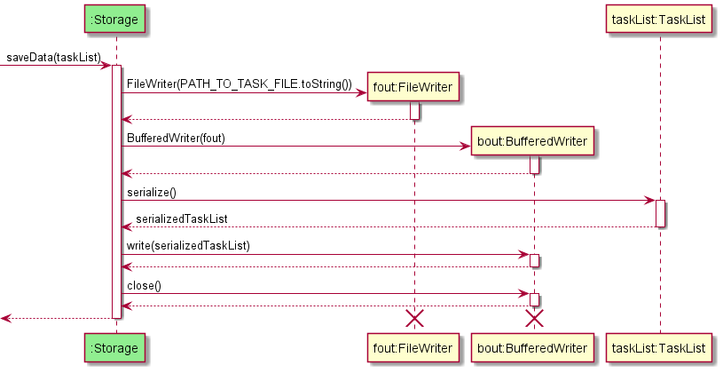

# Developer Guide

## Acknowledgements

{list here sources of all reused/adapted ideas, code, documentation, and third-party libraries -- include links to the original source as well}

## Design & implementation

### Storage component

**API** : [`Storage.java`](https://github.com/AY2122S1-CS2113T-W11-3/tp/blob/master/src/main/java/seedu/duke/storage/Storage.java)  

The storage component makes use of the serializing methods in the `taskList`, `lessonList`, and `moduleList` classes to save data to the `data` folder.
It also reads data from a given path into strings which can be utilized by those 3 list classes to create a list.

The `Storage` component has methods that:
* create the files `task.txt`, `lesson.txt`, `module.txt` in the `data` folder.
* load data from the file in the given path into an array of strings representing each line of data.
* save data of a given list by overwriting the respective file in the `data` folder with serialized data.

The following sequence diagrams below show how task data is [saved](#saving-data) and [loaded](#loading-data) using the Storage class.

#### Saving data:

#### Loading data:

### User Interface (UI) component
**API** : [`Ui.java`](../src/main/java/seedu/duke/ui/Ui.java)

The `Ui` component contains:
* the method `readUserResponse()` to read from the standard input.
* methods to print messages as strings to the standard output.
* constant strings, such as `LINE` and `PADDING`, which are used to format the printed messages.

The methods in the `Ui` component may call methods from `TaskList`, `LessonList` or `ModuleList` to get information from the respective components.

#### Printing tasks filtered by day of the week:

## Product scope
### Target user profile

{Describe the target user profile}

### Value proposition

{Describe the value proposition: what problem does it solve?}

## User Stories

|Version| As a ... | I want to ... | So that I can ...|
|--------|----------|---------------|------------------|
|v1.0|new user|see usage instructions|refer to them when I forget how to use the application|
|v2.0|user|find a to-do item by name|locate a to-do without having to go through the entire list|

## Non-Functional Requirements

{Give non-functional requirements}

## Glossary

* *glossary item* - Definition

## Instructions for manual testing

{Give instructions on how to do a manual product testing e.g., how to load sample data to be used for testing}
